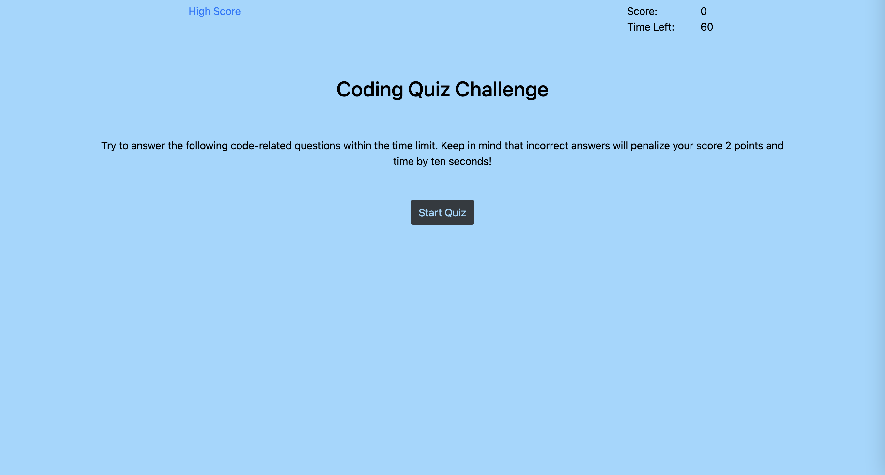

# coding-quiz

Coding Quiz Project Due : 26 DEC 2021

## Github Repo Link : https://github.com/Haguermeister/coding-quiz

## Webpage Link : https://haguermeister.github.io/coding-quiz/

## Screenshot Below :

---

## Grading Criteria :

---

#### AS A coding boot camp student

#### I WANT to take a timed quiz on JavaScript fundamentals that stores high scores

#### SO THAT I can gauge my progress compared to my peers

---

#### GIVEN I am taking a code quiz

#### WHEN I click the start button

#### THEN a timer starts and I am presented with a question XXX

#### WHEN I answer a question

#### THEN I am presented with another question XXX

#### WHEN I answer a question incorrectly

#### THEN time is subtracted from the clock XXX

#### WHEN all questions are answered or the timer reaches 0

#### THEN the game is over  XXX

#### WHEN the game is over

#### THEN I can save my initials and score XXX
